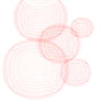

# numerical_methods  
  
### systemSolution:  
First folder containes 3 methods: Gauss, Cholesky and Sweep method (called \"running\")  
When program start, you need to enter a number of matrix size, for example 100 it's compute fast, but 500 it will be long.  
With source files in folder locate image with graphics of dependence between matrix size and time execution (integrated function work too fast).  
  


##### Task № 1 - Gauss (1/Gauss.py):    
  
##### Task № 2 - Sweep (1/Running.py):    
    
##### Task № 3 - Cholesky (1/Cholesky.py):   
   
  
### iterativeMethods:  
Is simillar situation like with first folder: Jacobi and Seidel.  
Also with source were attached images with graphics of same dependence.  
  
##### Task № 1 - Jacobi (2/Jacobi.py):     
   
##### Task № 2 - Seidel (2/Seidel.py):  
 
  
### approximation:  
As well as in first and second folders here are the sources. But in addition were attached bonus problem. For Lagrange's method - make it on random grid more faster then was (i can reach asymptotics O(n^2 + mn)) all proofs you can find on photo, which called like a it's source. For Splines method - do all on random grid. Derivation of formulas enclose in photo. There isn't just third superbonus, but it will apper soon.   

##### Task № 1 - Linear (3/Linear/py):    
  
##### Task № 2 - Lagrange (3/Lagrange+bonus.py):   
   
##### Task № 3 - Spline (3/Spline+bonus.py):   


#### Bonus tasks:
  
<strong>1) Lagrange with O(n^2 + m\*n) asymptotics:</strong>  

&nbsp;  

<strong>2) Spline on random grid:</strong>  

&nbsp;  

<strong>3) Spline on 2 demensional grid:</strong>  
All GUI was created using pygame.  
  
##### How to install:   
<code>pip install pygame</code>  
##### Structure of code:  
function for solve problem with 3 diagonal matrix  
<code>def func(a, b, c, f, N)</code>  
a - lower diagonal  
b - central diagonal  
c - upper diagonal  
f - answer vector  
##### function for generate splines:  
<code>def generateSpline(x, y)</code>  
x - coordinates of point on Ox axis  
y - coordinatws of point on Oy axis  
##### function for draw spline:  
<code>def draw(xFactors, yFactors, tStart, tEnd)</code>  
Where xFactors and yFactors are arrays of factor of polynomial At^3+Bt^2+Ct+D (for x(t) and y(t)), tStart and tEnd are coordinates of axis "T" start and end of segment of value.   
set color:  
white for background, red for curve, green for points  
<code>WHITE = (255, 255, 255)</code>    
<code>RED = (225, 0, 50)</code>   
<code>GREEN = (0, 225, 0)</code>   
<code>pygame.init()</code> - start pygame modul  
<code>window = pygame.display.set_mode((600, 600))</code> - create window 600x600 sizes  
<code>window.fill(WHITE)</code> - set white background  
<code>pygame.display.update()</code> - show window  
Main cycle will perform while won't push exit button. For control all events use  
<code>pygame.event.get()</code>  
This function generate list of all users action.  
If type of event will be QUIT  
<code>event.type == pygame.QUIT</code>  
program just finish execution.  
If user pressed the mouse button, program will know about them using  
<code>event.type == pygame.MOUSEBUTTONDOWN</code>  
and  
<code>event.button == 1</code>  
that it was left mouse button.  
After that program set white background  
<code>window.fill(WHITE)</code>  
draw all points  
<code>pygame.draw.circle(window, GREEN, (x[j], y[j]), 5)</code>  
generate splines for x and y  
<code>generateSpline(t, x)</code>  
and  
<code>generateSpline(t, y)</code>  
  
draw curse using  
<code>draw(...)</code>  
function, mapped on display all changes  
<code>pygame.display.update()</code>  
make pause 0.02 sec  
<code>pygame.time.delay(20)</code>  
and continue working.  

### mathematicalPhysics:
#### Diffusion:  
  
Main purpose - after pressing create temperature spot and it's distribution.
  
```
newMatrix[i][j] = matrix[i][j] + C * (matrix[i - 1][j] + matrix[i + 1][j] +matrix[i][j - 1] +
                                      matrix[i][j + 1] - 4 * matrix[i][j])
```   
<code>computing()</code> - main function for calculating cell temperature  
<code>draw()</code> - display surface  
<code>pressed = pygame.mouse.get_pressed()</code> - control of pressing on button  
<code>pos = pygame.mouse.get_pos()</code> - get cursor position during pressing    
<code>if pressed[0]:</code>  
&nbsp;&nbsp;&nbsp;&nbsp;<code>matrix[pos[0]][pos[1]] = 400.0</code> - set temperature in pressed pixel  
#### Wave:
   
```
matrix[i][j] = 2.0 * matrixOld[i][j] - matrixSuperOld[i][j] + C * (matrixOld[i+1][j] + matrixOld[i-1][j] +
                                                                   matrixOld[i][j-1] + matrixOld[i][j+1] -
                                                                   4.0 * matrixOld[i][j])
```  
<code>computing()</code> - main function for calculating wave distribution  
<code>draw()</code> - display surface  
<code>pressed = pygame.mouse.get_pressed()</code> - control of pressing on button  
<code>pos = pygame.mouse.get_pos()</code> - get cursor position during pressing    
<code>if pressed[0]:</code>  
&nbsp;&nbsp;&nbsp;&nbsp;<code>matrix[pos[0]][pos[1]] = 300.0</code> - start wave from pressed pixel 
